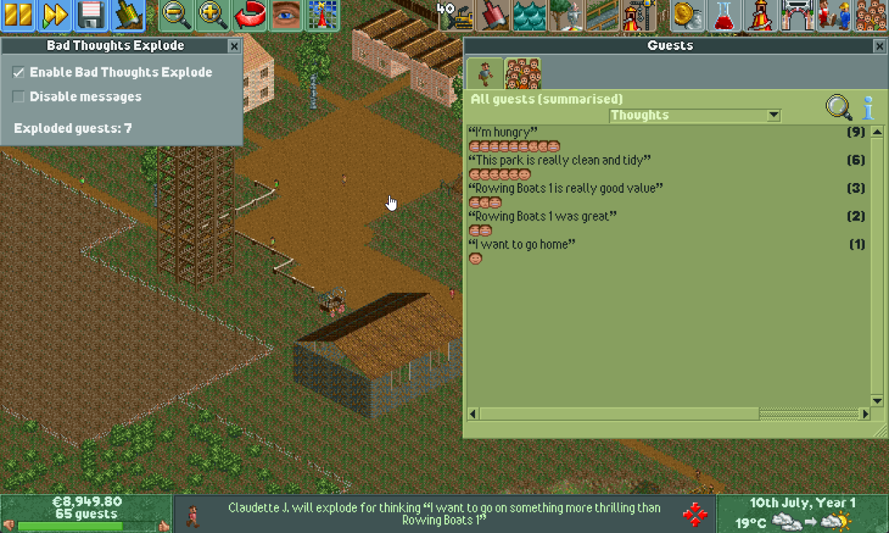

# OpenRCT2 Bad Thoughts Explode plugin

[OpenRCT2](https://openrct2.org/) plugin that makes guests explode if they have bad/negative thoughts. This plugin was created solely based on [Marcel Vos' YouTube video](https://www.youtube.com/watch?v=Ovoyu5nq-So). It is meant as a way to more easily distribute this functionality and I also wanted to see if I could create this as a plugin.



## Installing

Download the plugin ZIP from the the Releases page of this repository https://github.com/marko-hologram/openrct2-bad-thoughts-explode/releases.

Find your OpenRCT2 directory.

- Windows: `C:\Users\YourName\Documents\OpenRCT2`
- Mac: `/Users/YourName/Library/Application Support/OpenRCT2`
- Linux: `$XDG_CONFIG_HOME/OpenRCT2` or in its absence `$HOME/.config/OpenRCT2`

Extract the downloaded ZIP into that directory.

This should be your final folder structure:

```
└── OpenRCT2/
    └── plugin/
        └── openrct2-bad-thoughts-explode/
            └── bad-thoughts-explode.js
```

Start the game and you should see the message that the plugin loaded, but is not enabled. You have to enable it manually. This was done just so that guests don't start exploding right away immediately when you start a scenario.

You can enable the plugin in its settings which can be opened here:


## Caveats

This plugin doesn't instantly explode guests when they start having a negative thought. It checks every day which guests have negative thoughts and "marks" them to be exploded. Then game then decides when to explode them. I don't know all the details when that happens, but it's possible it happens the next day.

Another thing I didn't replicate is deducting $1 from your cash when a guest explodes. I didn't manage to find a way to show -$1.00 above exploded guest and Marcel seems to have used that only to track how many guests have exploded. Since this plugin has custom UI and custom code, it can show exploded count there without having to use these tricks.
